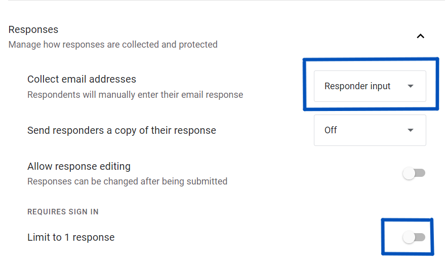
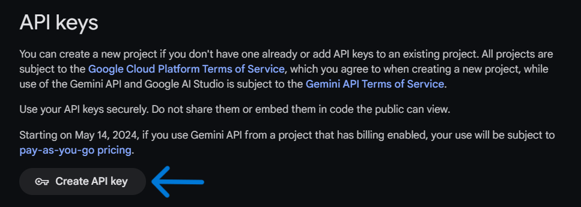
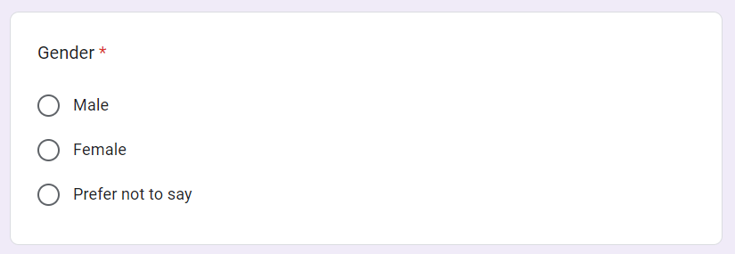
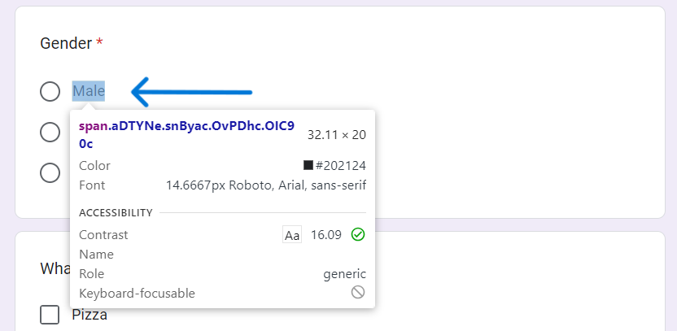
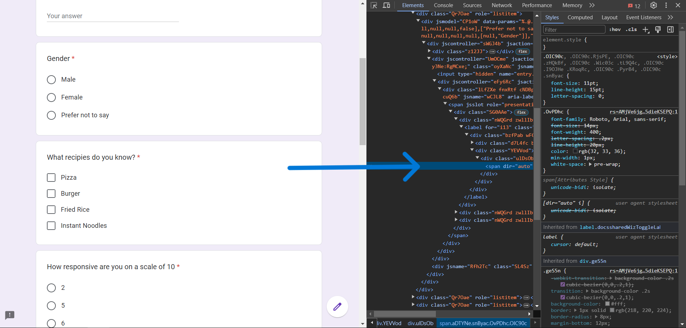
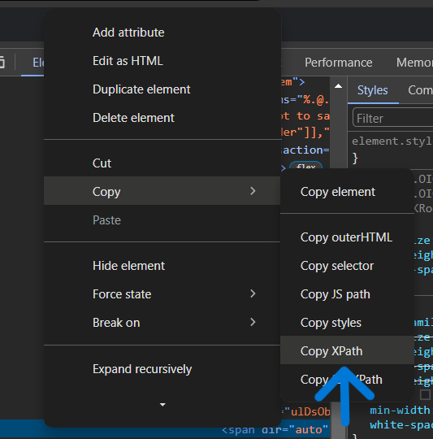
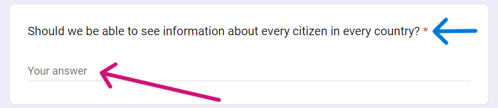
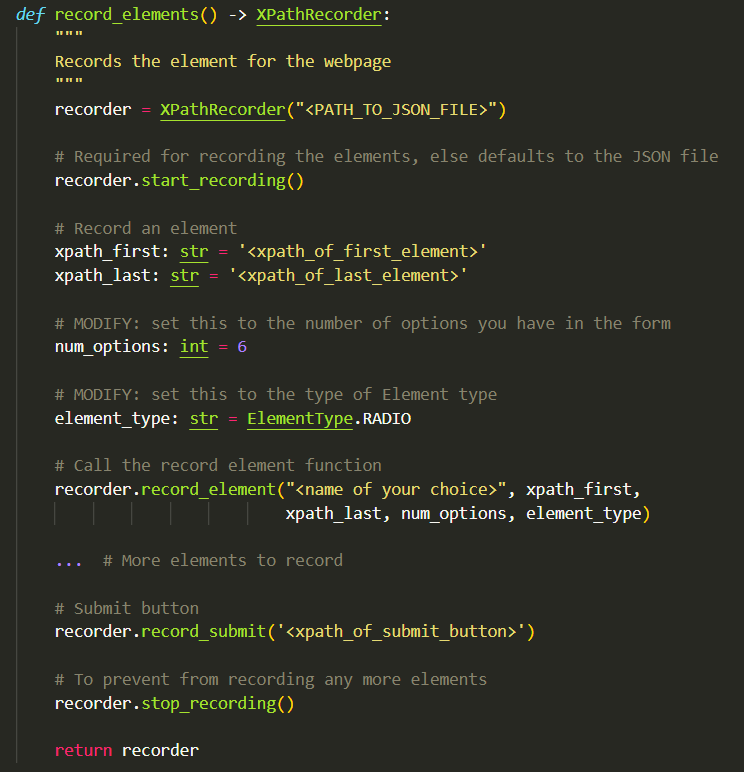

# Google Form Bot

<p align="justify">This bot can fill out your google form responses (TEXT, RADIO, CHECKBOX) and generates text using Gemini behind the hood</p>

### Sample to try: [Google Form](https://forms.gle/HucQVYPoUvxEHGVr9)


## Technologies Used

- **Selenium**: Selenium is an open source umbrella project for a range of tools and libraries aimed at supporting browser automation.
- **Python**: Python is a high-level, general-purpose programming language. Its design philosophy emphasizes code readability with the use of significant indentation.


## Required Settings for the form

- The bot uses `Chrome` as it's browser. Make sure it's installed properly.

- The bot is able to fill out:

    <ul>
    <li>Names</li>
    <li>Gender choices</li>
    <li>Radio inputs</li>
    <li>Checkbox inputs</li>
    <li>Text inputs (Short or Long paragraph)</li>
    </ul>

- The only required setting for the form is to disable the `requires sign-in`

  

## Installation

<p>If you don't have `Python` installed in your system, download it from <a href='https://python.org/downloads'>python.org downloads</a></p>

Run the following script in the terminal in project folder

```bash
git clone https://github.com/RakshitRabugotra/google-form-bot.git
```

Change into the cloned repo folder

```bash
cd google-form-bot
```

Make a python virtual environment

```bash
python -m pip venv venv
```

Install all the dependencies

```bash
python -m pip install -r requirements.txt
```

## Setup

1. **Setting up Gemini API for Text inputs**
   1. Get your `Gemini` API key from: [Google AI Studio]("https://aistudio.google.com/app/apikey)

      

   2. Copy the `API Key` and paste it in the `.env.example` file as `GEMINI_API_KEY`:

      ```ini
      LOG_FILENAME=app.log
      LOG_ENCODING=utf-8
      GEMINI_API_KEY=<YOUR_GEMINI_KEY>
      RESPONSE_MIN_LENGTH=<NUMBER_OF_WORDS>
      ```
   3. Rename `.env.example` to `.env`

2. **Setup for the driver**
   1. Configure the xPaths for the first time
   2. Run the driver with given template for main and fill the number of responses
   3. The program will run the chrome window till it reaches the given number of responses.
   4. You can check the log file (for nerds).

   **NOTE:** The **step(1)** needs to be performed only once per form, because it stores the structure of
   xPath in 'page.json' file and uses it in future to generate responses for the same form.

3. **Getting the XPath of the element:**

   The XPath of element is used to uniquely identify it in the DOM (Document Object Model)

   1. Choose a section:

      
      Press `F12` to open 'Developer's Console' and click on element selector icon in the top left of the developer's menu

   2. Selecting an option and copying `XPath`:

      
      Click on the text part of the element to select it in the DOM

      
      After selecting in the dom click on the element as shown in right side of the window.

      
      Right click it and goto `Copy`, then `Xpath` to copy the XPath of the element. Use it as the `xpath_first` in the next example

   3. Do the same for the last element and use it as the `xpath_last` in the next example

4. **Recording a `TEXT INPUT` element**

   The `name` of the element should be the actual question asked in the form (blue arrow).

   The `xpath_first` should be this text input's XPath. (purple-arrow) <br/>Whereas `xpath_last` should be set to `None`.

   

5. **Run the main file**

   Modify the function snippet `record_elements` in `main.py` and add the `XPath` of the HTML element to record:

   

   - Run the `main.py` by doing:
   ```bash
   python main.py
   ```

## Contributing

Contributions are welcome! If you have any ideas or improvements, feel free to open an issue or submit a pull request.

1. Fork the repository
2. Create a new branch

   ```bash
   git checkout -b feature/YourFeature
   ```

3. Commit your changes
   ```bash
   git commit -m 'Add some feature'
   ```
4. Push to the branch
   ```bash
   git push origin feature/YourFeature
   ```
5. Open a pull request

## License

This project is licensed under the MIT License. See the [LICENSE](https://github.com/RakshitRabugotra/google-form-bot/blob/main/LICENSE) file for details.

## Acknowledgements

- [Selenium](https://www.selenium.dev/)
- [Python](https://python.org/)

## Also read
- [Selenium-docs](https://selenium-python.readthedocs.io/)

## Contact

**Rakshit Rabugotra** - [LinkedIn](https://www.linkedin.com/in/rakshit-rabugotra-a29b5821a/)

**Project Link:** https://github.com/RakshitRabugotra/google-form-bot
